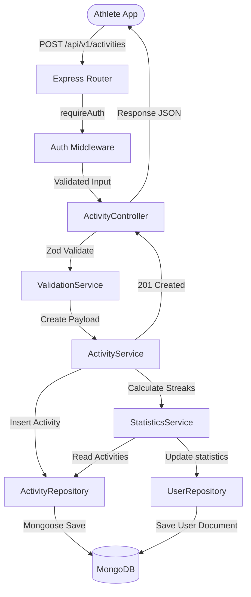
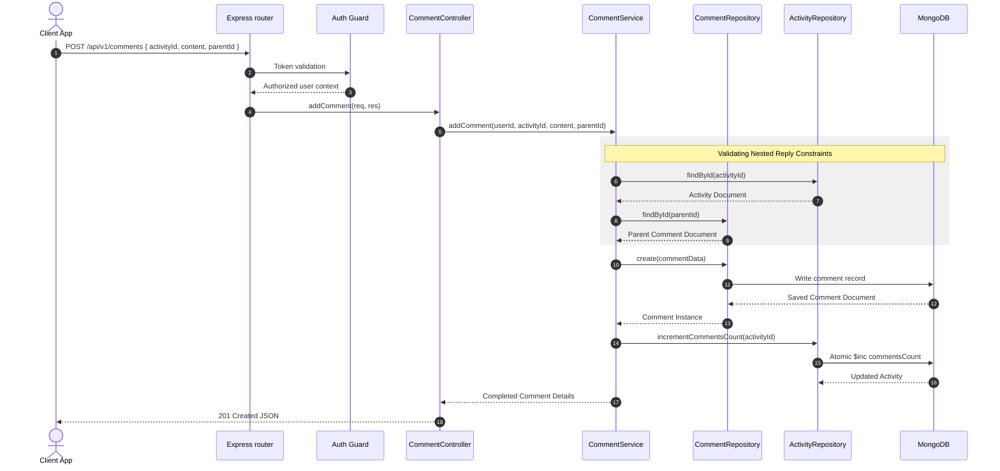

# Sweatly Activities & Feed Module Documentation

This document outlines the architecture, directory structure, request flows, and sequence interactions of Sweatly's Activity and Community Feed module.

---

## 1. Directory & Folder Structure

```
server/src/
├── models/
│   ├── activityModel.ts       # Activity schema, types, geo-spatial index
│   ├── commentModel.ts        # Nested commenting schema with parentId
│   └── likeModel.ts           # Unique likes schema
├── repositories/
│   ├── activityRepository.ts  # Proximity searches, participants signups, atomic counters
│   ├── feedRepository.ts      # Feed query parsing (time & geo-bounds)
│   ├── commentRepository.ts   # Replies fetching population
│   └── likeRepository.ts      # Like status queries
├── services/
│   ├── activityService.ts     # Activity CRUD orchestrator
│   ├── feedService.ts         # Cursor pagination tokenizer
│   ├── commentService.ts      # Nested hierarchy integrity service
│   ├── likeService.ts         # Like/unlike registry
│   └── statisticsService.ts   # User streak and statistics aggregator
├── middlewares/
│   └── ownershipMiddleware.ts # requireActivityHost & requireCommentAuthor guards
└── routes/
    ├── activityRoutes.ts      # Routes for /activities
    ├── feedRoutes.ts          # Routes for /feed
    ├── commentRoutes.ts       # Routes for /comments
    └── likeRoutes.ts          # Routes for /likes
```

---

## 2. Architecture & Data Flow Diagram

The following flowchart illustrates the data flow for **creating a new sports activity** and updating the user profile statistics:



---

## 3. Nested Comments Sequence Diagram

The following sequence diagram outlines how **adding a nested reply to a comment** is validated, registered, and how the parent comment counts are updated:



---

## 4. API Endpoint Definitions

| Endpoint | Method | Middleware Guards | Description |
| :--- | :--- | :--- | :--- |
| `/api/v1/activities` | `POST` | `requireAuth` | Creates a new sports activity. Automatically recalculates statistics. |
| `/api/v1/activities` | `GET` | `requireAuth` | Paginated listing of activities with title/address search, dates, and sports filters. |
| `/api/v1/activities/:id` | `GET` | `requireAuth` | Retrieves the details of a single activity. |
| `/api/v1/activities/:id` | `PATCH` | `requireAuth`, `requireActivityHost` | Updates activity details. |
| `/api/v1/activities/:id` | `DELETE`| `requireAuth`, `requireActivityHost` | Soft-deletes a sports activity. Recalculates statistics. |
| `/api/v1/activities/:id/join`| `POST` | `requireAuth` | RSVP to join an activity. Recalculates stats. |
| `/api/v1/activities/:id/leave`| `POST` | `requireAuth` | Cancel RSVP to leave an activity. Recalculates stats. |
| `/api/v1/activities/media` | `POST` | `requireAuth`, `uploadActivityMediaMiddleware` | Uploads up to 5 workout photos (max 5MB, JPEG/PNG/WebP). |
| `/api/v1/feed` | `GET` | `requireAuth` | Returns ranked feed items using cursor-based pagination and geo-filtering. |
| `/api/v1/comments` | `POST` | `requireAuth` | Creates comments or nested replies. Updates commentsCount. |
| `/api/v1/comments/:id` | `PATCH` | `requireAuth`, `requireCommentAuthor` | Edits an existing comment. |
| `/api/v1/comments/:id` | `DELETE`| `requireAuth`, `requireCommentAuthor` | Soft-deletes a comment. Updates commentsCount. |
| `/api/v1/likes/:activityId`| `POST` | `requireAuth` | Likes an activity. Atomic counter increment. |
| `/api/v1/likes/:activityId`| `DELETE`| `requireAuth` | Unlikes an activity. Atomic counter decrement. |
| `/api/v1/likes/:activityId/status`| `GET`| `requireAuth` | Returns boolean indicating if user liked the activity. |
