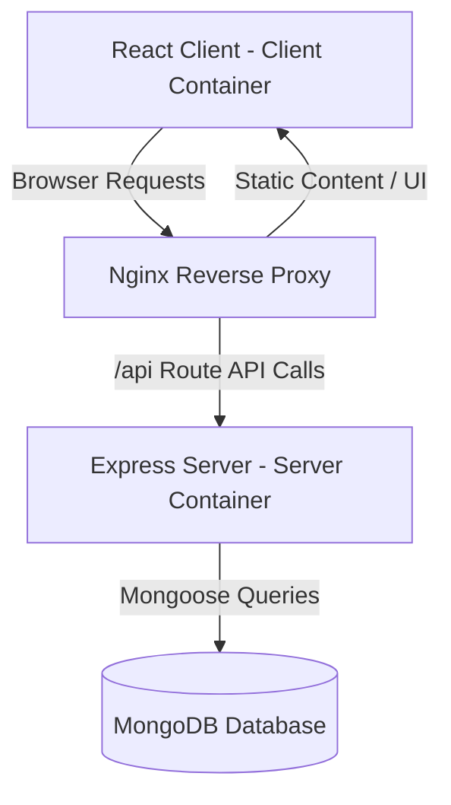

# Sweatly - Enterprise System Architecture

This document details the architectural decisions and system design for Sweatly.

## System Overview

Sweatly is designed as a single-page React client served through Nginx, backing off to a Node/Express REST API communicating with MongoDB.

## Architectural Decisions & Scaling Strategies

### 1. Monorepo (NPM Workspaces)
*   **Why:** Enables single-command dependency management and atomic commits.
*   **Shared Code:** Common validation schemas, interfaces/types, and domain constants are stored in `shared/` to enforce contract compliance between frontend and backend without duplicating code.

### 2. Reverse Proxy Layer (Nginx)
*   **Why:** Mitigates Cross-Origin Resource Sharing (CORS) complexities by exposing the application under a unified origin. It handles SSL termination, and routes requests intelligently:
    *   `/api/*` -> Forwarded to Node.js backend.
    *   `/*` -> Direct static asset loading from the frontend disk path.

### 3. Containerization
*   **Why:** Decoupled multi-stage Dockerfiles enforce immutable build artifacts. Development, staging, and production share the exact same runtime parameters, reducing environment discrepancies.

### 4. Database Layer (MongoDB)
*   **Why:** MongoDB is chosen for dynamic, document-based schemas matching fitness tracking data models (workout logs, exercises, sessions), which benefit from hierarchical document storage rather than rigid table structures.
