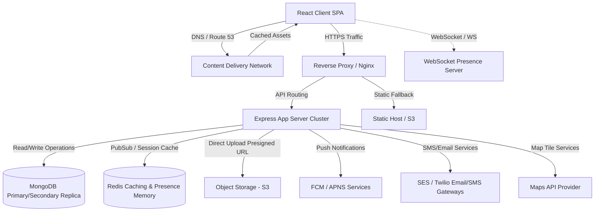
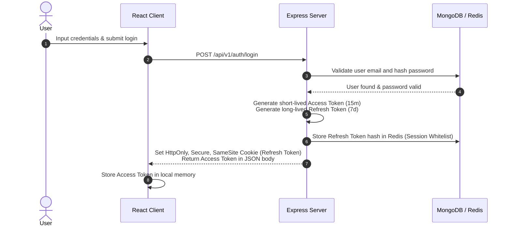
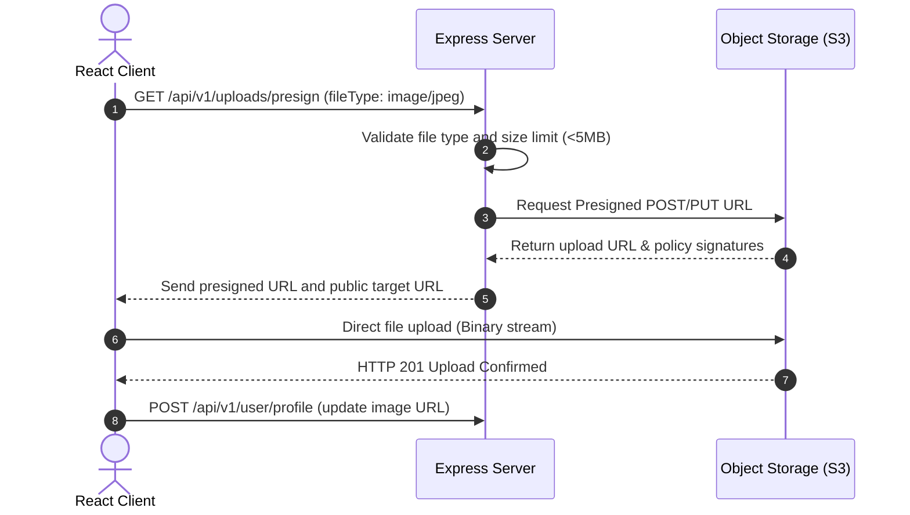
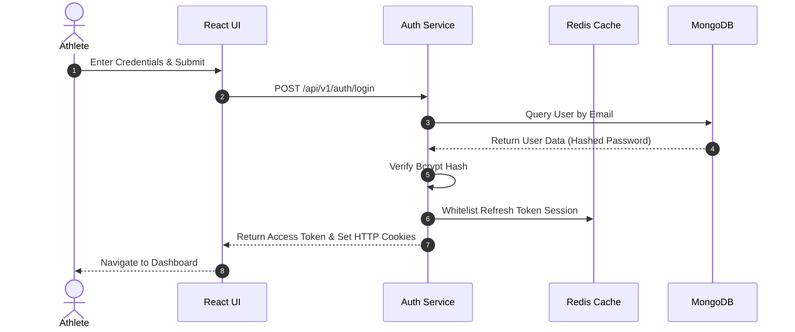
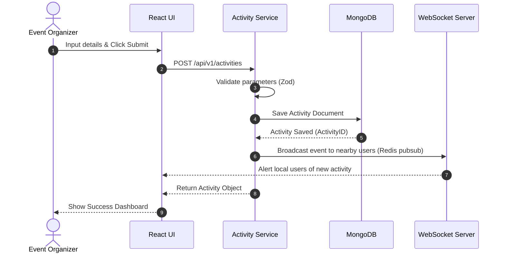
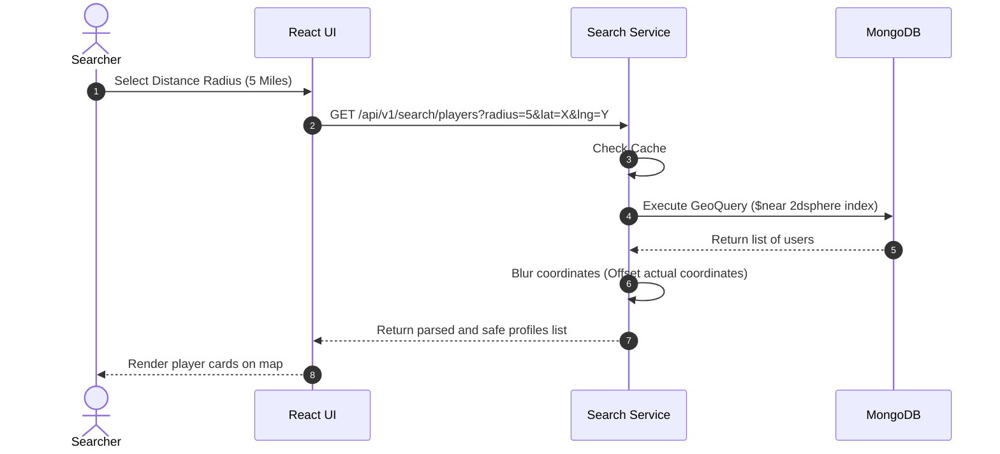
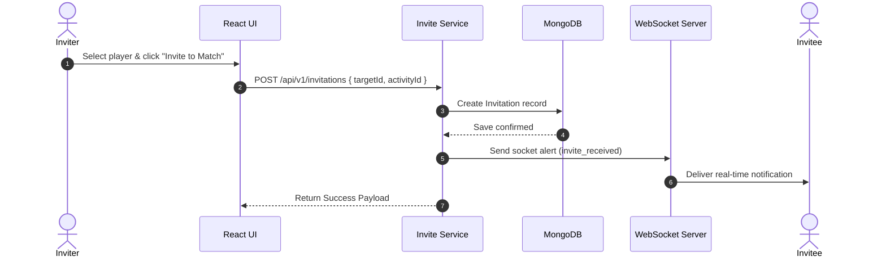
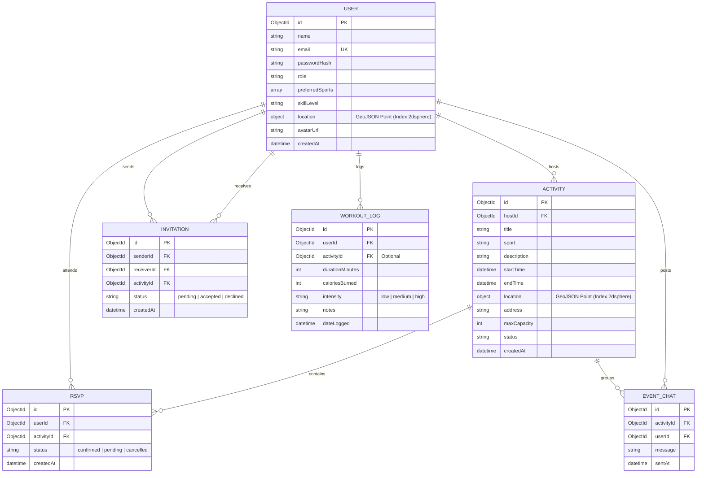

# Architecture Design Document (ADD) - Sweatly
**Project Name:** Sweatly  
**Author:** Senior Staff Software Engineer  
**Status:** Pending Approval  

---

## 1. High Level System Architecture

Sweatly employs a decoupled, multi-tier microservices-ready architecture that balances local development ease with production cloud scalability.



### Component Breakdown
1.  **React Client SPA:** A responsive, mobile-first single-page application. Renders dynamic UI and handles user state.
2.  **CDN (Content Delivery Network):** Edge-caches frontend bundles, assets, and images, reducing server load and latency.
3.  **Reverse Proxy (Nginx):** Manages SSL/TLS termination, rate limiting, and maps request paths (e.g., routing `/api/*` to Backend App Servers).
4.  **Backend Application Server:** Node/Express cluster executing business logic, coordinate filtering, and transactional workflows.
5.  **WebSocket Presence Server:** Decoupled cluster dedicated to managing persistent socket connections, delivering real-time messages, and mapping active user coordinates.
6.  **MongoDB Replica Set:** Non-relational database for document storage (profiles, activity logs) leveraging geospatial indexes.
7.  **Redis Cache & Pub/Sub:** Facilitates real-time presence caching, rate-limit counters, and syncs messages across multiple WebSocket container instances.
8.  **Object Storage (S3):** Secure, immutable storage for media and profile uploads, using pre-signed URLs to protect upload streams.
9.  **External Services:** Integrates Map Tile Providers (geo maps), FCM/APNS (push alerts), and Mailers (verification).

---

## 2. Frontend Architecture

### Feature-Based Folder Layout
The client is structured around features rather than technical layers, promoting cohesion and simplifying team scaling.

```
client/src/
├── assets/             # Global graphics, icons, and fonts
├── components/         # Shared, stateless presentational components (buttons, inputs)
├── features/           # Domain-driven features
│   ├── auth/           # Login, registration, token refresh logic
│   ├── matching/       # Geolocation search, athlete card view, matching lists
│   ├── community/      # Group activities, facility maps, posts
│   └── tracking/       # Workout logging, stats visualizations
├── hooks/              # Global custom hooks (e.g., useGeolocation, useDebounce)
├── layouts/            # Shared structural layout wrappers (Navbar, Sidebar)
├── services/           # Axios wrapper and centralized API boundary calls
├── styles/             # CSS theme variables and global styling overrides
└── utils/              # Clean helper functions (date calculations, parsing)
```

### Feature Autonomy
Each domain folder under `features/` maintains its own components, hooks, services, and state variables:
```
features/matching/
├── components/         # MatchingCard.jsx, RadiusSelector.jsx
├── hooks/              # useNearbyAthletes.js
├── services/           # matchingApi.js
└── matchingSlice.js    # Localized state (e.g., filters, radius)
```
This isolates changes, avoiding file modifications that span across unrelated modules.

### Routing Strategy
*   **Decoupled Route Configurations:** Routes are declared inside feature folders and imported into a central router file.
*   **Dynamic Lazy Loading:** Routes are loaded dynamically via code-splitting (`React.lazy`) to minimize initial bundle size.
*   **Route Guards:** Protected routes use higher-order wrapper components to check user authentication states and redirect unauthenticated users to `/login`.

### State Management Flow
*   **Server State (React Query):** Manages API query cache, optimistic updates, request deduplication, and automatic background data synchronizations.
*   **Global Client State (Context / Redux Toolkit):** Manages global cross-cutting variables like theme preferences, socket connections, and session states.
*   **Local UI State (useState):** Manages local view states (e.g., modal visibility, local input validation fields).

---

## 3. Backend Architecture

### Layered Architecture (Controller-Service-Repository)
The server separates concerns across distinct logic layers:

```
Request ──> Middleware ──> Validator ──> Controller ──> Service ──> Repository ──> Database
```

1.  **Controller Layer:** Parses incoming HTTP parameters, manages route mapping, and sends HTTP status envelopes.
2.  **Service Layer:** Executes core business logic, coordinates database transactions, enforces validation rules, and manages third-party service calls.
3.  **Repository Layer:** Handles database queries, maps raw models to schema interfaces, and isolates the database query language from business logic.

### Cross-Cutting Components
*   **Middleware:** Manages authentication, rate limiting, and request ID injections.
*   **Centralized Error Handling:** Connects an error handling middleware to capture custom errors, logging trace logs and returning clean JSON payloads.
*   **Data Transfer Objects (DTO):** Enforces data boundaries between internal service models and external API response structures.

---

## 4. Complete Folder Structure

Below is the production-grade folder structure for the Sweatly monorepo:

```
sweatly/
├── .github/
│   └── workflows/
│       ├── client-ci.yml
│       └── server-ci.yml
├── client/
│   ├── public/
│   └── src/
│       ├── assets/
│       ├── components/
│       │   ├── common/
│       │   └── layout/
│       ├── features/
│       │   ├── auth/
│       │   ├── community/
│       │   ├── matching/
│       │   └── tracking/
│       ├── hooks/
│       ├── layouts/
│       ├── routes/
│       ├── services/
│       ├── styles/
│       ├── utils/
│       ├── App.jsx
│       └── main.jsx
│   ├── .env.example
│   ├── .gitignore
│   ├── index.html
│   ├── package.json
│   └── vite.config.js
├── server/
│   ├── src/
│   │   ├── config/
│   │   ├── controllers/
│   │   ├── middlewares/
│   │   ├── models/
│   │   ├── repositories/
│   │   ├── routes/
│   │   ├── services/
│   │   ├── utils/
│   │   ├── app.js
│   │   └── index.js
│   ├── .env.example
│   ├── .gitignore
│   └── package.json
├── shared/
│   ├── src/
│   │   ├── constants/
│   │   └── validation/
│   └── package.json
├── docs/
│   ├── adr/
│   ├── api-spec.md
│   ├── architecture_design.md
│   └── srs.md
├── scripts/
│   ├── db-seed.js
│   ├── setup.ps1
│   └── setup.sh
├── docker/
│   ├── client.Dockerfile
│   └── server.Dockerfile
├── nginx/
│   └── default.conf
├── .gitignore
├── docker-compose.yml
└── package.json
```

---

## 5. Component Hierarchy

A visual representation of the React component tree:

```
App.jsx (Root Providers)
 └── AuthProvider
      └── SocketProvider
           └── RouterProvider
                ├── PublicLayout
                │    └── LoginPage (LoginForm -> Button, Input)
                └── MainLayout (Protected)
                     ├── Navbar (UserMenu, NotificationsDropdown)
                     ├── Sidebar (NavLinks)
                     └── DashboardRouter (Main Content View)
                          ├── MatchingPage
                          │    ├── FilterBar (DistanceSlider, SportFilter)
                          │    └── AthleteGrid
                          │         ├── AthleteCard (Avatar, ActivityStatus)
                          │         └── EmptyStateCard
                          ├── ActivityDetailsPage
                          │    ├── ActivityHeader (StatusBadge)
                          │    ├── AttendeeList (UserCard)
                          │    └── EventChatBox (MessageHistory, MessageInput)
                          └── ProfilePage
                               ├── ProfileHeader
                               └── WorkoutHistoryTable (PaginatedList)
```

### Reusable UI Architecture
*   **Presentational Components:** Elements like inputs, buttons, status badges, and skeleton loaders are stored in `components/common/`. They do not consume API endpoints directly; instead, they receive state and event handlers via props.
*   **Composability Pattern:** Components use `children` wrappers to support flexible layouts without requiring deep props inheritance.

---

## 6. API Request Lifecycle

The detailed lifecycle of a request from browser client back to database:

1.  **Browser Client:** User clicks "Join Event" in the client UI.
2.  **React App (State Modification):** React Query triggers a mutation `useMutation(joinEvent)`.
3.  **API Client Layer:** Axios intercepts the request, appends the Authorization Bearer Token, and dispatches an HTTP POST to `/api/v1/activities/:id/join`.
4.  **Express Router:** Nginx routes the request to the application server. Express matches the endpoint path and extracts params.
5.  **Middleware Execution:**
    *   **Rate Limiter:** Checks Redis request counts.
    *   **Auth Token Validator:** Verifies the JWT signature, extracts user payload, and appends the user model to `req.user`.
6.  **Request Validation (Zod):** A validation middleware checks the request body against a predefined schema, returning an HTTP 400 if validation fails.
7.  **Controller Layer:** Extracts the activity ID from `req.params.id` and user ID from `req.user.id`, and delegates execution to the Service layer.
8.  **Service Layer:** Executes business rules (e.g., checking if the user is already RSVP'd, or if the event has reached capacity).
9.  **Repository Layer:** Interacts with database drivers using schema definitions.
10. **Database (MongoDB):** Finds the document, appends the user ID to the RSVPs array, and returns the updated document.
11. **Response Pipeline:** The Service layer builds a DTO, the Controller wraps it in a standard JSON envelope (`{ success: true, data: { ... } }`), and returns it to the client with an HTTP 200.

---

## 7. Authentication Flow

Sweatly uses stateless JWT tokens stored in secure, HttpOnly, SameSite cookies to protect against Cross-Site Scripting (XSS) and Cross-Site Request Forgery (CSRF).



### Access Token Refresh Flow
When the client detects Access Token expiration:
1.  Client submits POST request to `/api/v1/auth/refresh` without passing tokens in headers.
2.  Server reads the HTTP cookie to retrieve the Refresh Token.
3.  Server validates the token's signature, queries Redis to verify the session remains whitelisted, and checks expiration.
4.  If valid, server returns a new Access Token in the JSON response body.
5.  If invalid or revoked, server clears the cookies and returns HTTP 401, triggering a client logout.

---

## 8. Authorization Flow

Role-Based Access Control (RBAC) restricts access to endpoints based on user roles:

| Route Path | Allowed Roles | Middleware Constraint |
| :--- | :--- | :--- |
| `POST /api/v1/activities` | `User`, `Admin`, `Moderator` | `requireRole(['User', 'Admin', 'Moderator'])` |
| `DELETE /api/v1/activities/:id` | `Admin`, `Moderator` (or Host Owner) | `requireOwnershipOrRole('activity', ['Admin', 'Moderator'])` |
| `GET /api/v1/admin/metrics` | `Admin` | `requireRole(['Admin'])` |

### Future Roles Implementation
Roles are mapped to permissions arrays, decoupling role strings from route logic. Adding a `Moderator` role involves declaring permissions like `delete_any_post` and mapping it to the user profile schema during token verification.

---

## 9. Database Flow

### CRUD Operations & Index Designs
*   **Write Operations:** Services generate transactions for writes that span multiple models (e.g., updating user stats when logging a workout).
*   **Geospatial Queries:** Location searches query the user database using MongoDB 2dsphere indexes. Coordinates are stored in GeoJSON format:
    ```json
    {
      "location": {
        "type": "Point",
        "coordinates": [longitude, latitude]
      }
    }
    ```
*   **Indexes:**
    *   `location: "2dsphere"` (for proximity searches)
    *   `email: 1` (unique index for auth lookups)
    *   `hostId: 1, startTime: -1` (compound index for activity feeds)

---

## 10. State Management Flow

We divide client state into distinct categories to maximize performance and avoid unnecessary renders:

```
[UI Component]
   ├── Reads Local UI State (useState) ──> Form validation states
   ├── Reads Server Cache (React Query) ──> User profile lists, event records
   └── Reads Global State (Redux/Context) ──> Socket connectivity, auth tokens
```

*   **Global Client State:** Manages global states like token cache and websocket connection status.
*   **Server State (React Query):** Implements stale-while-revalidate caching, auto-fetching, and background data synchronization.
*   **Local State:** Encapsulated within components using `useState` for local UI actions.
*   **Persistent UI State:** Saved to `localStorage` for cross-session settings like Dark/Light theme toggles.

---

## 11. Caching Strategy

```
[Client App] ──> check React Query Cache (In-Memory)
                       │
                 (Cache Miss)
                       ▼
[Proxy Cache / CDN] ──> serve Static Assets / Images
                       │
                 (Cache Miss)
                       ▼
[Server Cache] ──> check Redis Cache (Profiles, Active Sessions)
                       │
                 (Cache Miss)
                       ▼
[Primary Database] ──> query MongoDB (Populates Cache)
```

*   **Browser Caching:** Uses Cache-Control headers for static frontend assets (`public/assets`, JS, CSS).
*   **Server Cache (Redis):** Caches high-traffic database reads like user profile metadata.
*   **Cache Invalidation:** Employs write-through caching where updates to user profiles invalidate corresponding Redis keys.

---

## 12. Logging Strategy

Sweatly implements structured JSON logging to facilitate log aggregation:

```json
{
  "timestamp": "2026-07-02T16:50:00Z",
  "level": "error",
  "requestId": "req-987654",
  "userId": "usr_12345",
  "message": "Failed database write to workout collection",
  "stack": "MongoServerError: Write conflict..."
}
```

*   **Log Classification:** Separates logs into distinct files (`app.log`, `auth.log`, `error.log`).
*   **Log Rotation:** Daily log rotation splits files when they reach 20MB, archiving logs to compress file storage.
*   **Audit Logging:** Logs changes to critical state (e.g., changes to password schemas or admin roles) with details on user ID and source IP.

---

## 13. File Upload Flow

To minimize server resource consumption, Sweatly uses pre-signed upload URLs:



---

## 14. Notification Flow

Sweatly supports in-app, push, and email alerts using a centralized notification service:

```
[Event Trigger] ──> [Notification Dispatcher]
                         ├── Real-Time Socket? ──> Push to active WS Room
                         ├── Mobile Device Token? ──> Forward to APNS/FCM Gateway
                         └── Email Required? ──> Forward to SES/SMTP Gateway
```

*   **In-App Alerts:** Dispatched via socket connections to online users and logged to their notification document.
*   **Push Notifications:** Dispatched via Firebase Cloud Messaging (FCM) to user device tokens when users are offline.
*   **Preferences Engine:** Users can toggle notification channels (e.g., disabling emails for workout logs while keeping chat push alerts enabled).

---

## 15. Search Flow

The geospatial search architecture queries database records using location and distance metrics:

```
GET /api/v1/search/players?lat=40.7128&lng=-74.0060&radius=5&sport=tennis&page=1&limit=20
```

1.  **Coordinate Parsing:** The controller parses floating-point parameters for latitude and longitude.
2.  **Distance Filter Formulation:** Generates a MongoDB `$near` query utilizing the `2dsphere` index:
    ```javascript
    {
      location: {
        $near: {
          $geometry: { type: "Point", coordinates: [lng, lat] },
          $maxDistance: radius * 1609.34 // Miles to meters conversion
        }
      }
    }
    ```
3.  **Pagination:** Implements cursor-based pagination using the last retrieved record ID, avoiding performance issues common with traditional offset pagination on large datasets.

---

## 16. Real-Time Communication

Sweatly uses a persistent WebSocket layer to manage user presence and event chat coordination:

```
    [Web Client 1]                   [Web Client 2]
         │                                │
     (Socket)                         (Socket)
         ▼                                ▼
[WS Server Instance 1]           [WS Server Instance 2]
         │                                │
         └───────► [Redis Pub/Sub] ◄──────┘
```

*   **Redis Adapter:** Enables scaling to multiple app instances by syncing socket messages through Redis Pub/Sub channels.
*   **Presence Mapping:** Active socket IDs and user location coordinates are stored in Redis as temporary keys that expire when clients disconnect.
*   **Heartbeat Monitor:** Pings clients every 30 seconds to clean up orphaned socket connections.

---

## 17. Sequence Diagrams

### 17.1 User Login


### 17.2 Activity Posting


### 17.3 Finding Nearby Players


### 17.4 Sending Invite


---

## 18. ER Diagram

The Mongoose document definitions and relationships:



---

## 19. Architectural Decision Records (ADR)

### ADR-01: Monorepo with npm Workspaces
*   **Context:** The project requires a React frontend (`client`), an Express backend (`server`), and shared assets/validation logic (`shared`).
*   **Proposed Decision:** Maintain a single monorepo using npm workspaces instead of separate repositories.
*   **Alternative Approaches:** Separate codebases, or Git submodules.
*   **Tradeoffs:**
    *   *Pros:* Simplifies dependency updates, enables shared Zod schema validation across client and server, and streamlines CI pipeline configuration.
    *   *Cons:* Can result in large git clones and requires configuring workspace build pipelines.
*   **Industry Best Practices:** Standard practice for product teams sharing validation schemas and interfaces.
*   **Future Scalability:** Simplifies transitioning the project structure to a turborepo setup.

### ADR-02: Layered Controller-Service-Repository Backend Pattern
*   **Context:** Avoid placing routing configurations, query logic, and validation rules in single, monolithic files.
*   **Proposed Decision:** Enforce a strict controller-service-repository structure.
*   **Alternative Approaches:** Model-View-Controller (MVC) or Active Record patterns.
*   **Tradeoffs:**
    *   *Pros:* Decouples business logic from express routing protocols, simplifies writing unit tests, and allows swapping database drivers in the repository layer.
    *   *Cons:* Increases directory structures and requires boilerplate mapping.
*   **Industry Best Practices:** Promotes separation of concerns and maintainability in enterprise systems.

### ADR-03: Stateless JWT with Secure HttpOnly Cookies
*   **Context:** Implementing secure authentication for the API and client applications.
*   **Proposed Decision:** Store access tokens in memory and use short-lived validation cycles, combined with refresh tokens stored in secure, HttpOnly, SameSite cookies.
*   **Alternative Approaches:** Session store tokens in database tables, or storing tokens in LocalStorage.
*   **Tradeoffs:**
    *   *Pros:* Protects against XSS attacks and CSRF vulnerabilities.
    *   *Cons:* Requires managing token expiration and token refresh flows on the client side.
*   **Industry Best Practices:** Recommended security practice for web applications handling authentication.

### ADR-04: Real-time Communication using WebSockets with Redis Adapter
*   **Context:** The application requires real-time presence indicators, instant message updates, and live game invites.
*   **Proposed Decision:** Integrate a WebSocket server configured with a Redis adapter for multi-instance syncing.
*   **Alternative Approaches:** HTTP short polling, or Server-Sent Events (SSE).
*   **Tradeoffs:**
    *   *Pros:* Enables low-latency bi-directional messaging.
    *   *Cons:* Increases server resource utilization compared to stateless HTTP APIs.
*   **Industry Best Practices:** Standard for real-time notification engines.

### ADR-05: Randomized Geospatial Coordinate Blurring
*   **Context:** Users share location coordinates to connect with nearby players, raising privacy and safety considerations.
*   **Proposed Decision:** Store coordinates securely in the database, but offset locations by 200 meters before returning them to client queries.
*   **Alternative Approaches:** Storing coarse location markers (like zip codes), or exposing exact coordinate paths.
*   **Tradeoffs:**
    *   *Pros:* Enables proximity discovery while protecting user privacy.
    *   *Cons:* Prevents maps from showing the exact locations of players.
*   **Industry Best Practices:** Common privacy pattern used by location-based social platforms.
