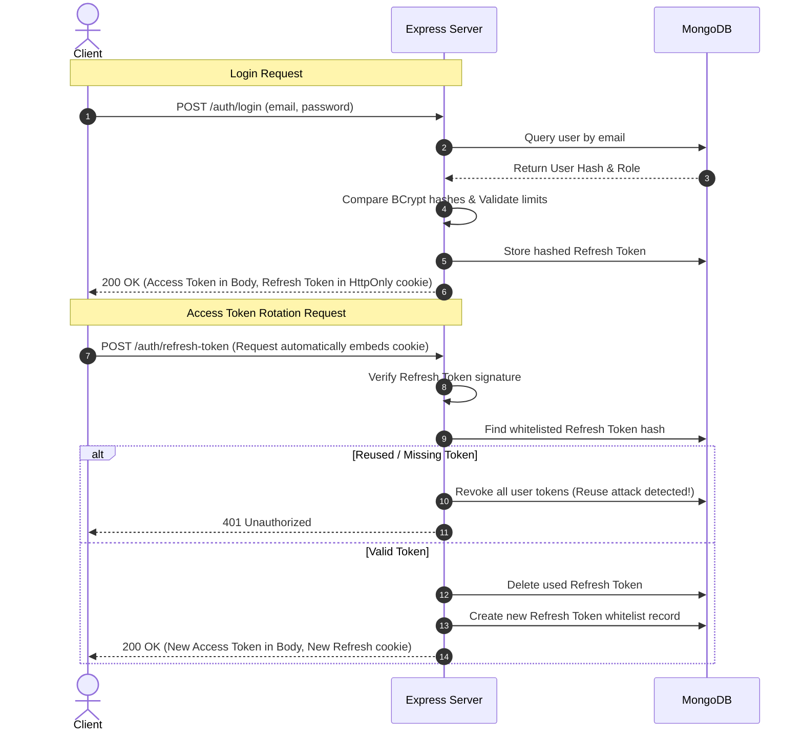

# Sweatly Authentication & Authorization Guide

This document describes the design, implementation, and routing configurations for the Authentication & Authorization module in Sweatly.

---

## 1. Sequence Diagram: Login and Token Rotation Flow

---

## 2. API Endpoints Map

All endpoints are versioned under `/api/v1/auth`:

| Verb | Endpoint | Authentication | Rate-Limited | Description |
|---|---|---|---|---|
| `POST` | `/register` | Public | Yes (10/15m) | Registers new profile, hashes pass, sends verify mail |
| `POST` | `/login` | Public | Yes (10/15m) | Verifies credentials, starts session, sets HttpOnly cookie |
| `POST` | `/logout` | Public | No | Revokes whitelist db record, clears cookie |
| `POST` | `/refresh-token` | Public | No | Rotates session tokens under strict reuse detection |
| `GET` | `/me` | Protected | No | Returns active session athlete context |
| `PATCH` | `/change-password`| Protected | No | Updates password |
| `POST` | `/forgot-password`| Public | Yes (10/15m) | Sends password reset email link |
| `POST` | `/reset-password` | Public | Yes (10/15m) | Validates reset token and sets new password |
| `POST` | `/verify-email` | Public | No | Sets user `isEmailVerified: true` |
| `POST` | `/resend-verification` | Public | Yes (10/15m) | Resends email verification link |
