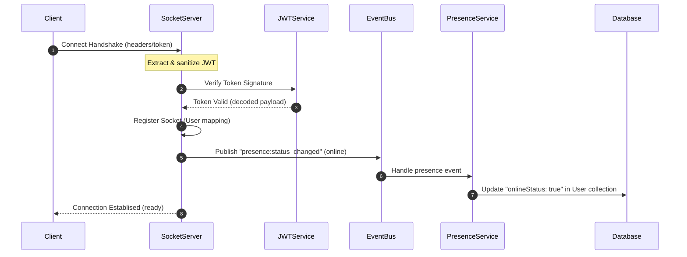
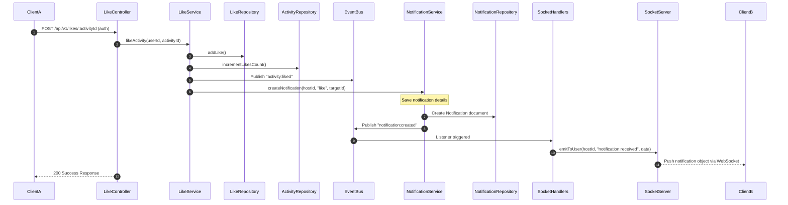

# Sweatly Realtime & Notifications Architecture Guide

This document explains the Event-Driven WebSocket and Notifications infrastructure built for Sweatly.

---

## 1. Sequence Flow Diagrams

### WebSocket Connection & Authentication Flow
Below is the connection authentication flow during handshake:

---

### Realtime Notification Event Cycle (e.g. Activity Liked)
Below is the cycle starting from an HTTP API request to real-time notification push:

---

## 2. Presence Tracking & Connection Mapping
- **Multiple Session support**: In-memory connection manager tracks active sessions using a `Map<string, Set<string>>` of `userId -> SocketIDs`.
- **Database Synchronization**: Presence status changes publish to the local `EventBus` to prevent tight coupling. The `PresenceService` listens to these triggers and updates the User collection's `onlineStatus` and `lastSeen` values.

## 3. OpenAPI Specifications
- **Notification API definitions**: Detailed under [swagger_notifications.yaml](file:///c:/Users/ADMIN/sweat/docs/swagger_notifications.yaml).
- **Nearby, Grounds, & Sessions API definitions**: Detailed under [swagger_maps_sessions.yaml](file:///c:/Users/ADMIN/sweat/docs/swagger_maps_sessions.yaml).
