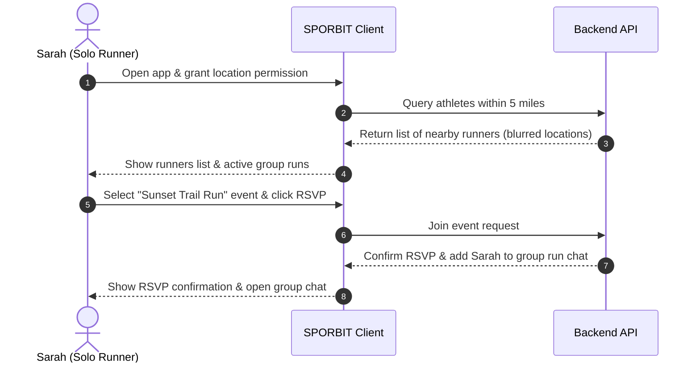

# Software Requirements Specification (SRS) for SPORBIT
**Project Name:** SPORBIT  
**Author:** Senior Staff Software Engineer  
**Status:** Pending Approval  

---

## 1. Problem Statement

### Section Content (SPORBIT Context)
In modern urban environments, people struggle to maintain active, healthy lifestyles due to social isolation, lack of coordination tools, and difficulty finding local workout partners or sports groups. Existing social networks are generalized and favor passive online consumption rather than real-world physical activity. Conversely, local sports centers lack unified platforms that facilitate spontaneous or scheduled match-ups, coordinate games, track skill levels, or build neighborhood communities. Consequently, enthusiasts remain inactive because they lack a localized network or are intimidated by the overhead of organizing real-world sports activities.

---

### Section Context (Staff Engineer Meta-Explanation)
*   **Why it exists:** It defines the target user pain points and market friction. Without a clear problem definition, engineering teams risk building features that do not solve real needs.
*   **Why it is important:** It aligns business strategy and engineering scope, preventing "feature creep" by acting as a litmus test for all proposed features.
*   **Alternative approaches:** A purely list-based feature wishlist or a competitor analysis.
*   **Tradeoffs:** Defining a narrow problem statement aligns the MVP, but it may omit broader business expansion opportunities.
*   **Industry best practices:** Anchor the problem statement in empirical user data and focus on user-centric friction rather than technical limitations.

---

## 2. Vision

### Section Content (SPORBIT Context)
To establish the premier location-based sports and fitness ecosystem that transforms digital connections into physical collaborations. SPORBIT envisions a world where finding an athlete, organizer, teammate, or workout buddy within a 2-mile radius is as seamless as booking a ride-share, leading to healthier, highly-connected local communities.

---

### Section Context (Staff Engineer Meta-Explanation)
*   **Why it exists:** It sets the long-term aspirational goal of the product.
*   **Why it is important:** It inspires the engineering team, guides architectural scaling decisions, and sets the direction for future product phases.
*   **Alternative approaches:** Mission statements or short marketing taglines.
*   **Tradeoffs:** An ambitious vision provides direction but lacks actionable sprint constraints.
*   **Industry best practices:** Keep the vision statement concise, customer-centric, and focused on physical or behavioral outcomes.

---

## 3. Objectives

### Section Content (SPORBIT Context)
1.  **Objective 1 (Connection):** Enable users to discover and establish direct contact with local athletes matching similar sports interests and skill levels.
2.  **Objective 2 (Organization):** Streamline the scheduling, reservation, and management of real-world sports activities, matches, and workouts.
3.  **Objective 3 (Engagement):** Gamify participation to drive repetitive real-world activity and long-term user retention.
4.  **Objective 4 (Community):** Establish local micro-communities centered around specific sports facilities or neighborhoods.

---

### Section Context (Staff Engineer Meta-Explanation)
*   **Why it exists:** It decomposes the high-level vision into clear pillars.
*   **Why it is important:** It allows engineering leads to map functional requirements to specific outcomes.
*   **Alternative approaches:** OKRs (Objectives and Key Results) or standard business targets.
*   **Tradeoffs:** Rigid objectives can limit pivots, while vague objectives fail to guide feature prioritization.
*   **Industry best practices:** Keep objectives high-level and focused on outcomes rather than specific features.

---

## 4. Functional Requirements

### Section Content (SPORBIT Context)
*   **FR-1: Geolocation & Distance Filtering**
    *   Query and filter athletes, activities, and communities by physical distance (e.g., radius of 1, 5, 10 miles).
*   **FR-2: Dynamic User Profiles**
    *   Set up sports-specific skill tiers, availability windows, and physical goals.
*   **FR-3: Activity & Event Lifecycle**
    *   Create, join, edit, and cancel local events. Include roles for hosts/organizers and players/participants.
*   **FR-4: Real-Time Communication**
    *   One-to-one chat for coordinate pairings, and group chats associated with specific events or clubs.
*   **FR-5: Interactive Map Interface**
    *   Visual representation of active meetups, user clusters, and local sports facilities.
*   **FR-6: Workout Logging & Progress**
    *   Post-event logging of workout parameters (duration, intensity, notes) with options to sync with other players.

---

### Section Context (Staff Engineer Meta-Explanation)
*   **Why it exists:** It lists the software's capabilities—what the system must do.
*   **Why it is important:** It is the primary blueprint for developers, QA testers, and product managers during the building phase.
*   **Alternative approaches:** User story maps or wireframe annotations.
*   **Tradeoffs:** Comprehensive specifications reduce ambiguity but require significant upfront drafting effort.
*   **Industry best practices:** Use unique, traceable identifiers (e.g., FR-1) and keep descriptions clear and actionable.

---

## 5. Non-Functional Requirements

### Section Content (SPORBIT Context)
*   **NFR-1: Scalability & Performance**
    *   The geosearch queries must resolve within 200ms for up to 10,000 active concurrent queries.
*   **NFR-2: Availability & Reliability**
    *   Maintain 99.9% uptime for core API endpoints.
*   **NFR-3: Privacy & Security**
    *   Ensure exact user location coordinates are never exposed directly to clients; use randomized location blurring in lists and maps.
*   **NFR-4: Usability & Accessibility**
    *   Support mobile-first responsive interfaces conforming to Web Content Accessibility Guidelines (WCAG 2.1 AA).

---

### Section Context (Staff Engineer Meta-Explanation)
*   **Why it exists:** It defines the quality attributes and constraints of the system (how it must perform).
*   **Why it is important:** It governs infrastructure, database selection, security configurations, and frontend framework configurations.
*   **Alternative approaches:** Service Level Agreements (SLAs) or operational manuals.
*   **Tradeoffs:** High performance constraints increase infrastructure cost and development overhead.
*   **Industry best practices:** Quantify every requirement with measurable limits (e.g., 200ms latency) to allow automated validation.

---

## 6. User Personas

### Section Content (SPORBIT Context)

#### Persona A: "The Solo Runner" - Sarah, 27
*   **Bio:** A marketing professional who relocated to a new city. She wants to find a local running partner to stay motivated.
*   **Frustrations:** Safety concerns when running alone; generic meetups are too large and inflexible.
*   **Needs:** Location matching, verification mechanisms, and shared schedule availability.

#### Persona B: "The Organizer" - Marcus, 34
*   **Bio:** A recreational soccer league organizer.
*   **Frustrations:** Tracking who is attending games; coordinating last-minute replacements; managing venue bookings.
*   **Needs:** Invites, RSVPs, automated waiting lists, and broadcast messaging tools.

---

### Section Context (Staff Engineer Meta-Explanation)
*   **Why it exists:** To create realistic representations of target users based on research.
*   **Why it is important:** It helps developers build empathy and prevents the team from designing for themselves instead of the users.
*   **Alternative approaches:** Market segments or raw demographic profiling.
*   **Tradeoffs:** Creating personas adds design cycles, and overly specific profiles can lead to niche feature sets.
*   **Industry best practices:** Limit personas to 2 or 3 core profiles, anchoring them in actual user research and qualitative interviews.

---

## 7. User Journey

### Section Content (SPORBIT Context)

---

### Section Context (Staff Engineer Meta-Explanation)
*   **Why it exists:** It visualizes the user experience step-by-step to achieve a goal.
*   **Why it is important:** It exposes friction points and reveals missing logical flows before coding starts.
*   **Alternative approaches:** Textual flow descriptions or wireframes.
*   **Tradeoffs:** Complex visual flows take time to maintain as requirements evolve.
*   **Industry best practices:** Model both optimal paths and error paths (e.g., rejected location access).

---

## 8. User Stories

### Section Content (SPORBIT Context)
*   **US-1 (Athlete Search):** *As a* sports enthusiast, *I want to* filter nearby users by sport and skill level, *so that* I can find compatible partners.
*   **US-2 (Event Creation):** *As an* event host, *I want to* create an activity specifying location, date, time, and maximum players, *so that* others can join my match.
*   **US-3 (Messaging):** *As a* participant, *I want to* message other event attendees, *so that* we can coordinate matching colors or equipment.
*   **US-4 (Location Blurring):** *As a* privacy-conscious user, *I want* my precise location to be blurred, *so that* my privacy is protected while using local matching.

---

### Section Context (Staff Engineer Meta-Explanation)
*   **Why it exists:** It captures requirements from the end-user's perspective.
*   **Why it is important:** It is the unit of work for agile sprint planning.
*   **Alternative approaches:** Direct product feature specifications.
*   **Tradeoffs:** Writing user stories requires a lot of collaboration, but it ensures value-driven delivery.
*   **Industry best practices:** Follow the standard INVEST criteria (Independent, Negotiable, Valuable, Estimable, Small, Testable).

---

## 9. Acceptance Criteria

### Section Content (SPORBIT Context)
*   **AC-US-1 (Athlete Search):**
    *   *Given* a user has granted location permission, *when* they filter by "Tennis" and "Intermediate", *then* only users within their selected radius with those parameters must be displayed.
    *   *Given* location permissions are denied, *when* searching, *then* the app must prompt the user to select a zip code or city.
*   **AC-US-4 (Location Blurring):**
    *   *Given* a list of nearby athletes, *when* a location query is run, *then* coordinates returned by the API must be randomized within a 200-meter offset from their actual location.

---

### Section Context (Staff Engineer Meta-Explanation)
*   **Why it exists:** It defines the boundaries and requirements that must be met to mark a user story complete.
*   **Why it is important:** It aligns developers and QA teams on what constitutes a successful feature implementation.
*   **Alternative approaches:** Open-ended QA testing checklists.
*   **Tradeoffs:** Writing detailed acceptance criteria requires significant effort, but it prevents misunderstandings.
*   **Industry best practices:** Use the Scenario-based (Given-When-Then) format to clarify expectations.

---

## 10. Scope

### Section Content (SPORBIT Context)
The initial release covers the onboarding, profile generation, sport-specific configurations, and proximity matching systems. It includes basic scheduling tools, location-blurred mapping, and individual/group messaging capabilities.

---

### Section Context (Staff Engineer Meta-Explanation)
*   **Why it exists:** Defines the functional boundaries of what is included in the current development cycle.
*   **Why it is important:** Essential for project management to deliver the product on schedule.
*   **Alternative approaches:** Product backlog prioritization matrices.
*   **Tradeoffs:** Restricts development flexibility, but keeps projects on track.
*   **Industry best practices:** Align scope directly with the resource constraints and timeframes of the project.

---

## 11. Out of Scope

### Section Content (SPORBIT Context)
*   Integrations with wearable fitness hardware (Apple Watch, Garmin, Fitbit).
*   In-app payment processing for venue rentals or paid trainer sessions.
*   In-app leagues, points tracking, or formal tournament bracket generators.

---

### Section Context (Staff Engineer Meta-Explanation)
*   **Why it exists:** Explicitly states what will NOT be built.
*   **Why it is important:** Prevents misunderstandings between stakeholders, designers, and developers.
*   **Alternative approaches:** Leaving boundaries undefined.
*   **Tradeoffs:** Can limit design creativity, but protects against scope creep.
*   **Industry best practices:** Clearly document out-of-scope items during initial requirements gathering.

---

## 12. Future Scope

### Section Content (SPORBIT Context)
*   Integration with local sports facilities to allow direct court/field booking.
*   Automatic synchronization with wearables (Garmin, Strava, Apple Health).
*   Trainer profiles and marketplace setup.
*   Corporate wellness league support.

---

### Section Context (Staff Engineer Meta-Explanation)
*   **Why it exists:** Holds feature ideas for future iterations without impacting the current phase.
*   **Why it is important:** Shows a clear roadmap for the product and keeps the team motivated.
*   **Alternative approaches:** A flat backlog with no prioritization.
*   **Tradeoffs:** Prompts conversations about futures, but can distract from immediate MVP priorities.
*   **Industry best practices:** Group future roadmap features by strategic themes or phases.

---

## 13. Assumptions

### Section Content (SPORBIT Context)
*   Users will grant location access permissions on mobile devices.
*   Municipalities or facilities have public/private courts or fields accessible for events.
*   Users are willing to meet real-world partners to play sports.

---

### Section Context (Staff Engineer Meta-Explanation)
*   **Why it exists:** Documenting beliefs that are assumed true but not yet verified.
*   **Why it is important:** Unverified assumptions are the leading cause of project delays and failures.
*   **Alternative approaches:** Assuming silently without documentation.
*   **Tradeoffs:** Over-analysis of assumptions can cause delays; however, ignoring them risks failure.
*   **Industry best practices:** Regularly review and validate assumptions through user interviews and data analyses.

---

## 14. Risks

### Section Content (SPORBIT Context)
*   **Risk 1 (Safety):** Bad actors using proximity tracking to harass users.
*   **Risk 2 (Cold Start):** Low initial user density in a location, making matching ineffective.
*   **Risk 3 (Trust):** Users scheduling games but not showing up, leading to frustration.

---

### Section Context (Staff Engineer Meta-Explanation)
*   **Why it exists:** Identifies obstacles that could derail the project.
*   **Why it is important:** Allows the team to design mitigations early in the development lifecycle.
*   **Alternative approaches:** Post-mortem analysis after a failure occurs.
*   **Tradeoffs:** Documenting risks can alarm business teams, but it is necessary for mitigation.
*   **Industry best practices:** Rate risks by impact and likelihood, and assign clear mitigation strategies.

---

## 15. Edge Cases

### Section Content (SPORBIT Context)
*   **Edge Case 1 (Density Extremes):** A user in a rural location searches with a 2-mile radius and finds no matches (solution: dynamic fallback to expand search radius).
*   **Edge Case 2 (Overlapping Schedules):** A user RSVPs to multiple events scheduled at the same time (solution: warning prompt for double-booking).
*   **Edge Case 3 (Rapid Location Changes):** A user accesses the app while traveling on a high-speed train (solution: throttle location updates and restrict matching if velocity exceeds normal levels).

---

### Section Context (Staff Engineer Meta-Explanation)
*   **Why it exists:** Documenting low-probability user scenarios that could break the application.
*   **Why it is important:** Helps developers write robust error handling code and keeps user satisfaction high.
*   **Alternative approaches:** Fixing bugs reactively after they are reported in production.
*   **Tradeoffs:** Adds development complexity for scenarios that impact few users.
*   **Industry best practices:** Address edge cases early in the design phase to avoid complex database refactoring later.

---

## 16. Business Rules

### Section Content (SPORBIT Context)
*   **BR-1 (Host Authority):** Only the creator of an event can edit its time, location, or cancel it.
*   **BR-2 (Age Restrictions):** Users must be 18 or older to register and organize events without parental consent.
*   **BR-3 (Activity Capacity):** Users cannot join an event that has reached its maximum capacity.
*   **BR-4 (Account Suspensions):** Accounts with three verified "no-show" reports within 30 days are automatically suspended for two weeks.

---

### Section Context (Staff Engineer Meta-Explanation)
*   **Why it exists:** Defines the operating rules of the business that the application must enforce.
*   **Why it is important:** Ensures the code reflects business policies and compliance requirements.
*   **Alternative approaches:** Implementing rules ad-hoc in the frontend without clear backend validation.
*   **Tradeoffs:** Strict rules can impact user growth, but they protect the integrity of the community.
*   **Industry best practices:** Keep business rules centralized and distinct from user interface logic.

---

## 17. Success Metrics (KPIs)

### Section Content (SPORBIT Context)
*   **Daily/Monthly Active Users (DAU/MAU Ratio):** Aiming for a ratio of >30%.
*   **Event RSVP-to-Participation Conversion Rate:** Target >85% of RSVPs attend the real-world event.
*   **Retention Rate (Day 7 / Day 30):** Targets of >45% and >20% respectively.
*   **Net Promoter Score (NPS):** Aiming for >40 through user satisfaction surveys.

---

### Section Context (Staff Engineer Meta-Explanation)
*   **Why it exists:** Measures of product success and system performance.
*   **Why it is important:** Directs resource allocation based on data rather than assumptions.
*   **Alternative approaches:** Subjective assessments of product success.
*   **Tradeoffs:** Collecting metrics requires analytics overhead and can raise privacy questions.
*   **Industry best practices:** Use a mix of retention, engagement, and growth metrics.

---

## 18. MVP Definition

### Section Content (SPORBIT Context)
The SPORBIT MVP (Minimum Viable Product) will contain:
1.  **Auth & Profiles:** User signup, selection of 3 preferred sports, and self-selected skill level.
2.  **Matching:** Location-blurred user matching within a 5-mile radius.
3.  **Events:** Simple host-created activities with RSVP capabilities.
4.  **Coordination Chat:** Text-based event group chats.

---

### Section Context (Staff Engineer Meta-Explanation)
*   **Why it exists:** The absolute smallest feature set that can be released to solve the core problem.
*   **Why it is important:** Minimizes time-to-market and gathers real user feedback before investing further capital.
*   **Alternative approaches:** Fully-featured releases.
*   **Tradeoffs:** A basic MVP may disappoint some users, but it is necessary to validate product market fit.
*   **Industry best practices:** Focus the MVP on a single core user loop (Discovery -> Match -> RSVP -> Chat).
