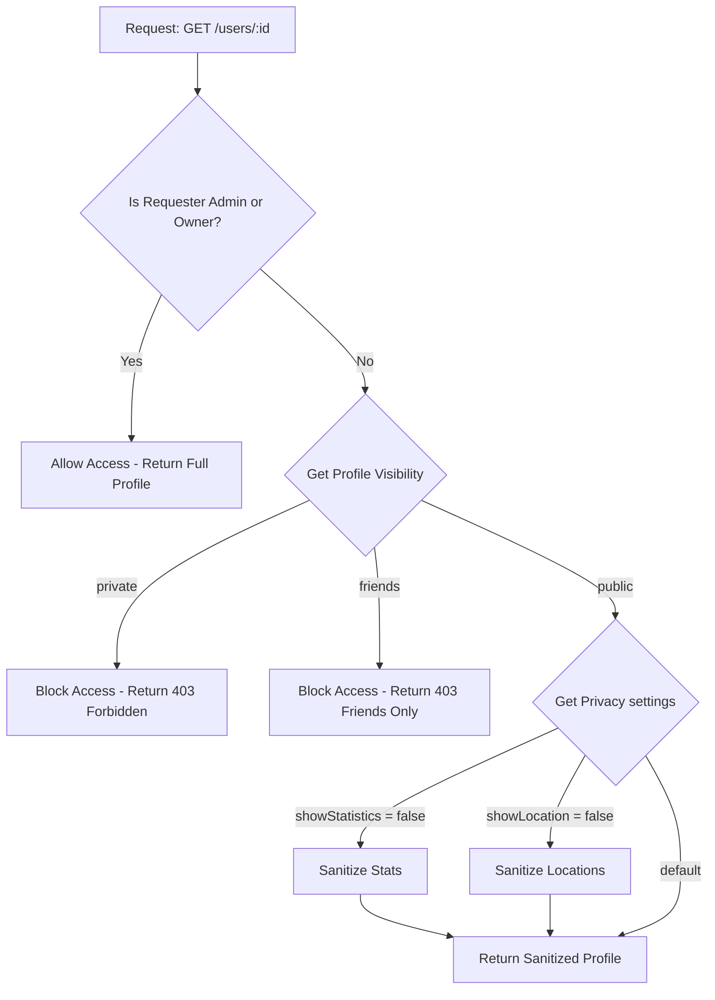
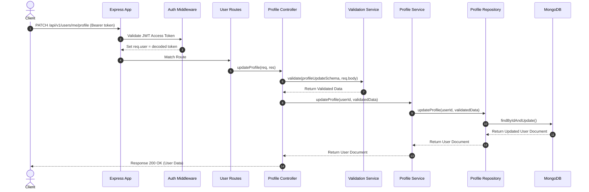

# Sweatly User Module Documentation

This document describes the design, folder structure, files, flow diagrams, and sequence diagrams for the Sweatly **User Module**.

---

## 1. Folder Structure

Below is the directory mapping of the files generated or updated in this phase:

```
├── shared/
│   └── src/
│       └── index.ts                 # [UPDATED] Added Zod Schemas for User, Sports, Location, & Privacy updates
├── server/
│   ├── jest.config.js               # [UPDATED] Added test MONGODB_URI startup definition
│   ├── src/
│   │   ├── app.ts                   # [UPDATED] Mounted userRouter at /api/v1/users
│   │   ├── models/
│   │   │   └── userModel.ts         # [UPDATED] Extended Schema with profile, sports, location, privacy, & stats fields
│   │   ├── repositories/
│   │   │   ├── index.ts             # [UPDATED] Exported new repositories
│   │   │   ├── userRepository.ts     # [UPDATED] Added findByUsername method
│   │   │   ├── profileRepository.ts  # [NEW] Profile, sports, privacy database operations
│   │   │   └── locationRepository.ts # [NEW] Geospatial coordinates and nearby lookups
│   │   ├── services/
│   │   │   ├── validationService.ts # [NEW] Zod parsing and operational error wrapper
│   │   │   ├── imageService.ts      # [NEW] Pluggable upload design & validations
│   │   │   ├── userService.ts       # [NEW] User fetch operations
│   │   │   ├── profileService.ts    # [NEW] Profile details and avatar storage interactions
│   │   │   └── locationService.ts   # [NEW] Proximity logic and bounds checks
│   │   ├── middlewares/
│   │   │   ├── ownershipMiddleware.ts          # [NEW] Restricts edits to owner or Admins
│   │   │   ├── profileVisibilityMiddleware.ts  # [NEW] Intercepts requests & filters by privacy settings
│   │   │   └── fileValidationMiddleware.ts     # [NEW] Multer memory storage and error handler
│   │   ├── controllers/
│   │   │   ├── userController.ts    # [NEW] Fetches and filters public profiles
│   │   │   ├── profileController.ts # [NEW] Updates details, sports, and privacy
│   │   │   ├── locationController.ts# [NEW] Coordinates location adjustments & nearby searches
│   │   │   └── uploadController.ts  # [NEW] Receives profile picture changes
│   │   ├── routes/
│   │   │   └── userRoutes.ts        # [NEW] User module REST path mapping
│   │   └── tests/
│   │       └── user.test.ts         # [NEW] Unit, validation, repository, & API integration tests
└── docs/
    ├── swagger_user.yaml            # [NEW] OpenAPI 3.0.3 Specification
    └── user_module_readme.md        # [NEW] User Module architectural documentation
```

---

## 2. File Explanations

### Models
- **`userModel.ts`**: Defines Mongoose schemas and strict TypeScript interfaces for sports details, locations, privacy configuration, and statistics. Includes a pre-save hook to generate unique default usernames.

### Repository Layer
- **`userRepository.ts`**: Extended with a case-insensitive `findByUsername` query.
- **`profileRepository.ts`**: Provides methods to write updates to profile, sports (mapping string IDs to Mongoose ObjectIds), and privacy subdocuments.
- **`locationRepository.ts`**: Handles coordinates updates and runs geospatial query operators (`$near`) to find players inside a specific radius.

### Service Layer
- **`validationService.ts`**: Evaluates Zod schemas and raises a 400 Bad Request exception if constraints are violated.
- **`imageService.ts`**: Validates MIME types (JPEG, PNG, WebP) and size limits (5MB) before uploading to a swap-ready `IStorageProvider`.
- **`userService.ts`**: Core lookups for users by ID and username.
- **`profileService.ts`**: Ensures username uniqueness and coordinates avatar replacements and deletion.
- **`locationService.ts`**: Performs geospatial coordinate validations.

### Middlewares
- **`ownershipMiddleware.ts`**: Verifies that the requester is the owner of the resource or an Admin.
- **`profileVisibilityMiddleware.ts`**: Validates privacy configuration (public/private/friends) before letting requests reach public endpoints.
- **`fileValidationMiddleware.ts`**: Integrates Multer to intercept images upload.

### Controllers
- **`userController.ts`**: Handles `/me` requests and sanitizes public profile details before returning them.
- **`profileController.ts`**: Handles updates to profile, sports details, and privacy.
- **`locationController.ts`**: Updates current/home locations and performs nearby athlete lookups.
- **`uploadController.ts`**: Handles avatar upload and deletion.

---

## 3. Flow Diagram: Profile Visibility Check

This flow shows how the `profileVisibilityMiddleware` decides whether to allow a user to view another player's profile:



---

## 4. Sequence Diagram: Profile Update Process

This diagram illustrates a PATCH request to update the user's basic profile details:


